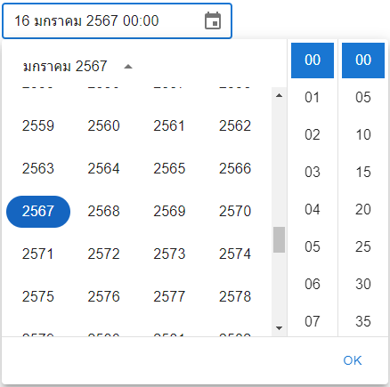

# DateTimePicker Buddhist Era
This project is a part DatetimePicker for buddhist Era [Information Code](./DateTime.tsx) :computer:

:triangular_flag_on_post: Fill in DateTime on Input Box <br>
:triangular_flag_on_post: Select Day on DateTimePicker <br>
:triangular_flag_on_post: Select Year on DateTimePicker <br>

### INSTALL MUI
 ```
 npm install @mui/material @emotion/react @emotion/styled
 ```

### INSTALL MUI-LIBRARY DatePicker
 ```
 npm install @mui/x-date-pickers@7.11.0
 ```

### INSTALL MOMENT ADAPTER
 ```
 npm install moment@2.30.1
 ```

### Example Code
 ```javascript
    const [ getValue , setValue ] = React.useState("")
    <DatePickerBuddhist
        Value={getValue}
        OnChangeDate={setValue}
    />
 ```
### Examples UI


