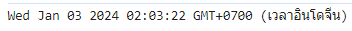

# DateTimePicker Buddhist Era
This project is a part DatetimePicker for buddhist Era

:triangular_flag_on_post: Fill in DateTime on Input Box <br>
:triangular_flag_on_post: Select Day on DateTimePicker <br>
:triangular_flag_on_post: Select Year on DateTimePicker <br>

### INSTALL MUI
 ```
 npm install @mui/material @emotion/react @emotion/styled
 ```

### INSTALL MUI-LIBRARY DatePicker
 ```
 npm i @mui/x-date-pickers
 ```

### INSTALL MOMENT ADAPTER
 ```
 npm i moment
 ```

### Examples UI

